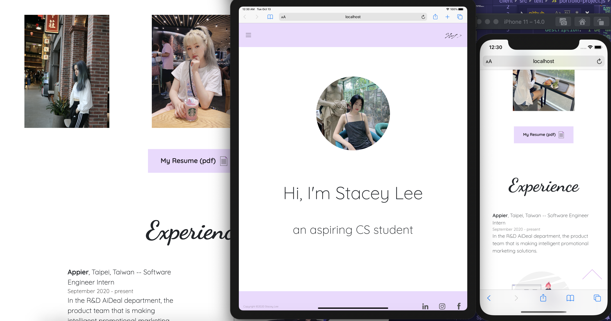

# Stacey's Website

Stacey believes this website would help her future employees or friends to better understand her experiences. 

This website is created by Stacey independently, from coding the FE/BE to UI design. 

## Visuals

 

## Local Installation

1. Run the server

    ```
    cd server
    npm i
    npm start
    (open localhost:8000 in browser)
    ```

2. In another window, run the client

    ```
    cd client
    npm i
    npm start
    (open localhost:3000 in browser)
    ```

3. To see all the form responses, run the admin

    ```
    cd admin
    npm i
    npm start
    (open localhost:3001 in browser)
    ```

** Note: these are default port numbers. It might change if the port is already in use on your computer. 

## Support

If you need help accessing the website, or see something not working, please don't hestitate to contact [staceyleetsaihsun@gmail.com](mailto:staceyleetsaihsun@gmail.com).

## Project status

This website will continued to be maintained by Stacey herself. 

